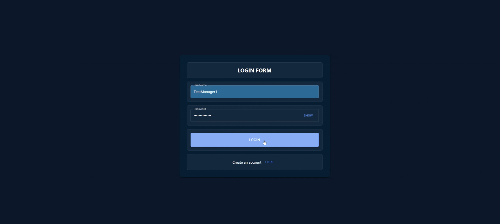

# test-blog
Simple blog platform with React, Node.js, and Material-UI. Manage posts, replies, likes, and dark mode. Built during a PCTO work experience.

# Features 
* Creation of accounts saved on the server's json file
* Role-based access control: managers can edit any account
* Creation of posts and replies all saved in the server's json
* A like system, keeping track of likes on posts making you able to access your liked history
* Pages to view all personal posts and reply history
* Dark mode toggle

# Prerequisites

Before running the project, make sure you have:

- [Node.js](https://nodejs.org/) version 18 or higher installed.
- npm (comes with Node.js).
- Git for cloning the repository.

## Setup

1. Clone this repo:
   ```bash
   git clone https://github.com/Marco-Cappellini/test-blog.git
   cd test-blog
2. Navigate to the react section
   ```bash
   cd ./users-frontend/users-frontend
3. install the dependencies:
   ```bash
   npm install
4. Build the project
   ```bash
   npm run build
5. Navigate to the node section
   ```bash
   cd ..
   cd ..
   cd ./"node express"
6. Create the webpage directory
   ```bash
   mkdir webpage
7. Copy the build in webpage
   ```bash
   cd ..
   mv ./users-frontend/users-frontend/dist/* ./"node express"/webpage/
8. Return to the node section and insall the dependencies
   ```bash
   cd "node express"
   npm install
9.  Setup environment variables:
   Copy the example environment file to create your own `.env` file:
    ```bash
    cp .env.example .env
    ```
    ⚠ When filling the file be sure that the port is the same as the one in the .env of the frontend ⚠ 
10. Start the project:
   ```bash
   node index.js
   ```
11. Open your browser and copy the fist page url <div>
   By default it should be localhost:3000

# Demo
### This is how the program should look like after you started it and clicked on the login button (bottom of the first page)
<div>



**Login credentials for demo account:**

* *Username:* TestManager1
* *Password:* Password123123

⚠ If you sign up as an employee, you won’t have access to the "Edit All Accounts" page. ⚠

## License

This project is licensed under the MIT License. See the [LICENSE](./LICENSE) file for details.
